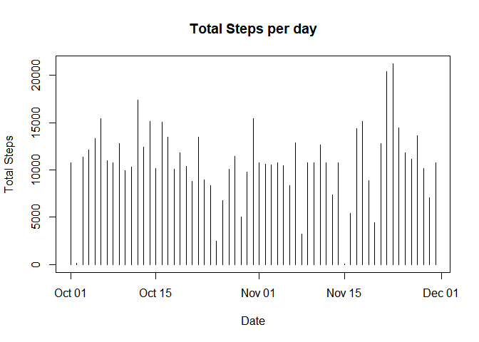

## Loading and preprocessing the data


```r
activity <- read.csv("activity.csv")
activity$date <- as.Date(activity$date)
```

## What is mean total number of steps taken per day?

```r
library(tidyverse)
total_steps <- data.frame(activity %>% group_by(date) %>% summarise(Steps = sum(steps)))
plot(total_steps$date, total_steps$Steps, type = "h", xlab = "Date", ylab = "Total Steps", main = "Total Steps per day")
```

<!-- -->

```r
print(paste("Mean of total steps per day is", mean(total_steps$Steps, na.rm = TRUE), sep = " "))
```

```
## [1] "Mean of total steps per day is 10766.1886792453"
```

```r
print(paste("Median of total steps per day is", median(total_steps$Steps, na.rm = TRUE), sep = " "))
```

```
## [1] "Median of total steps per day is 10765"
```


## What is the average daily activity pattern?

```r
summarised_steps <- data.frame(activity %>% group_by(interval) %>% summarise(mean_Steps = mean(steps, na.rm = TRUE)))
plot(summarised_steps$interval, summarised_steps$mean_Steps, type = "l", xlab = "Interval", ylab = "Average number of steps taken", main = "Average daily activity pattern")
```

<!-- -->

## Imputing missing values

```r
print(paste("The sum of total number of NA values in the dataset is ", sum(is.na(activity)), sep = " "))
```

```
## [1] "The sum of total number of NA values in the dataset is  2304"
```

```r
new_activity <- activity
new_activity$steps[is.na(new_activity$steps)] <- mean(new_activity$steps, na.rm = TRUE)
total_steps_new <- data.frame(new_activity %>% group_by(date) %>% summarise(Steps = sum(steps)))
plot(total_steps_new$date, total_steps_new$Steps, type = "h", xlab = "Date", ylab = "Total Steps", main = "Total Steps per day")
```

<!-- -->

```r
print(paste("Mean of total steps per day is", mean(total_steps_new$Steps, na.rm = TRUE), sep = " "))
```

```
## [1] "Mean of total steps per day is 10766.1886792453"
```

```r
print(paste("Median of total steps per day is", median(total_steps_new$Steps, na.rm = TRUE), sep = " "))
```

```
## [1] "Median of total steps per day is 10766.1886792453"
```

```r
print(paste("The mean of total number of steps per day is same as befor imputing the values, whereas the median for the same increases"))
```

```
## [1] "The mean of total number of steps per day is same as befor imputing the values, whereas the median for the same increases"
```


## Are there differences in activity patterns between weekdays and weekends?

```r
new_activity$weekday <- factor(weekdays(new_activity$date))
levels(new_activity$weekday) <- c("weekday", "weekday", "weekend", "weekend", "weekday", "weekday", "weekday")
x <- data.frame(new_activity %>% group_by(weekday, interval) %>% summarise(steps = mean(steps)))
library(ggplot2)
g <- ggplot(x, aes(interval, steps))
g <- g + geom_line() + facet_wrap(weekday~., nrow = 2) + labs(x = "Interval") + labs(y = "Number of Steps") + labs(title = "Average activity patterns over weekday or weekend") + theme(plot.title = element_text(hjust = 0.5))
print(g)
```

<!-- -->
